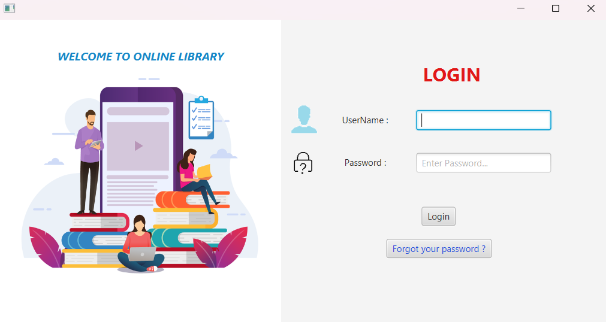
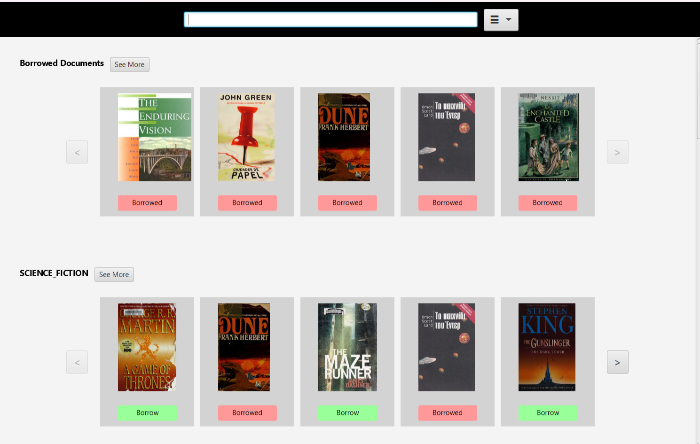
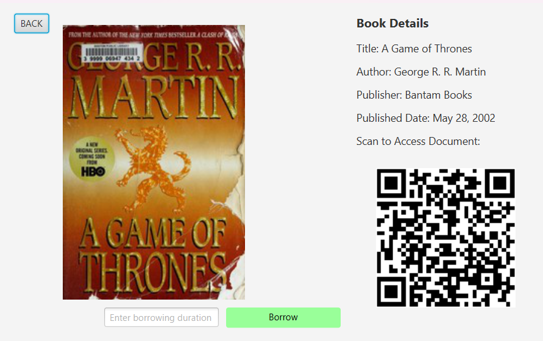
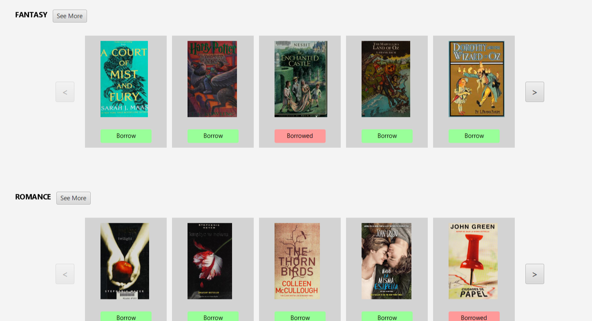
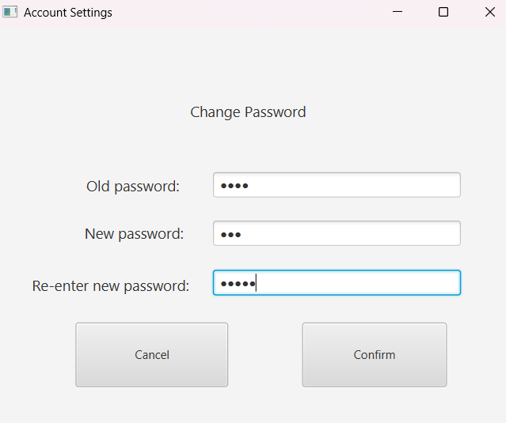
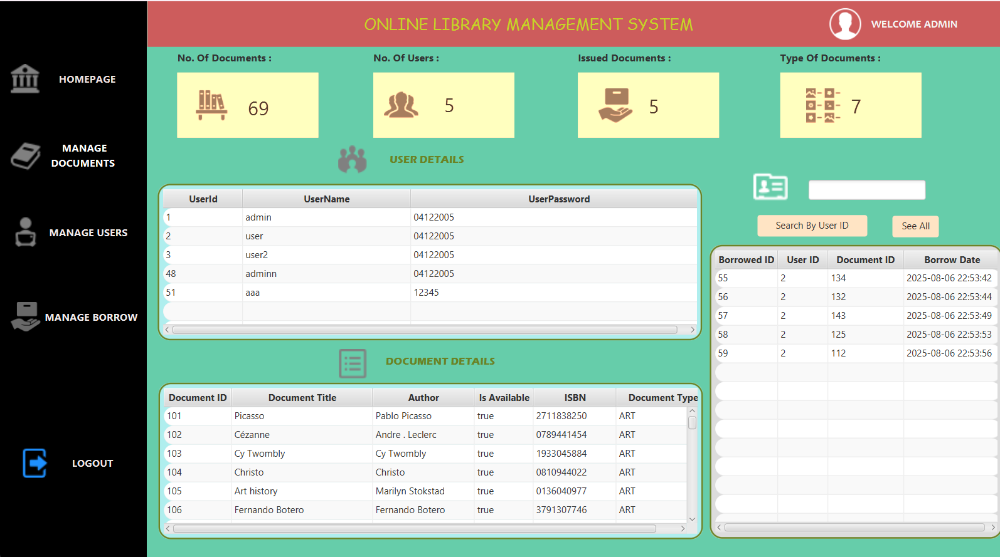
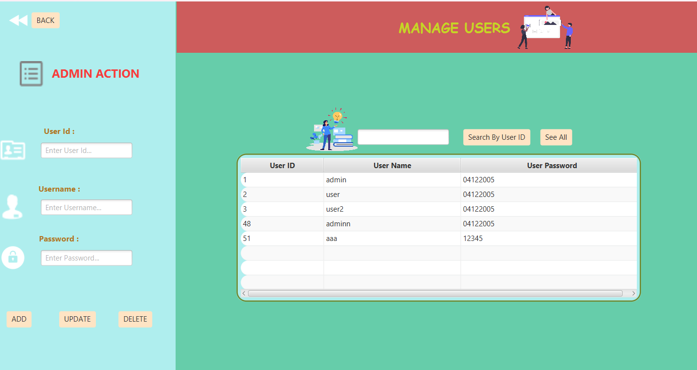
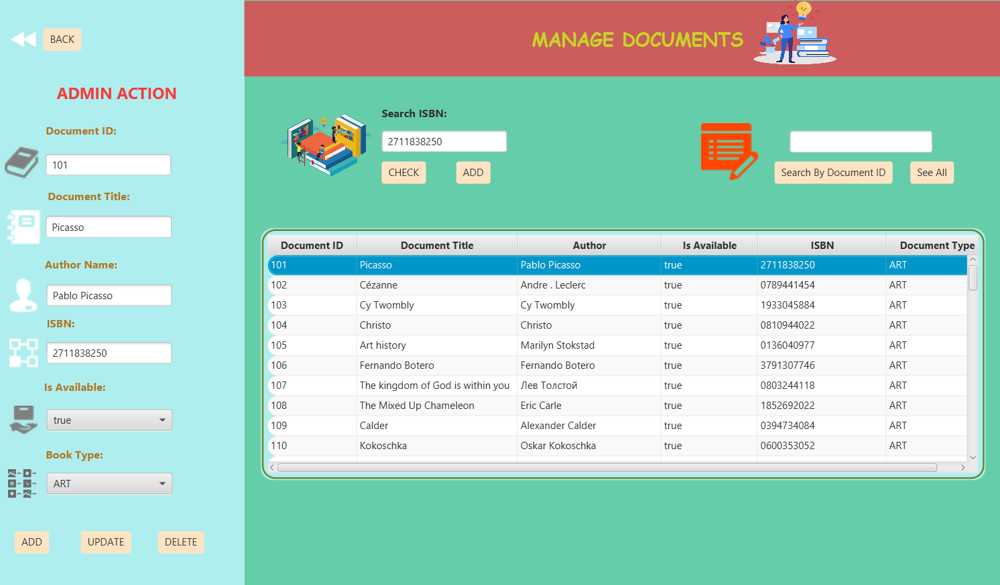
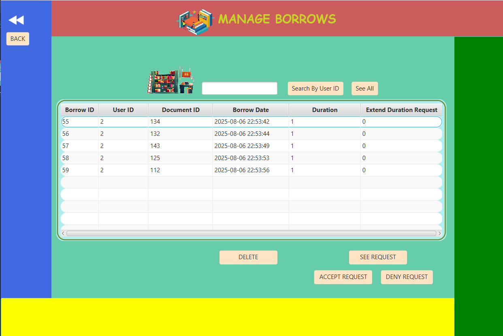

# Features

This document outlines the main features of the LibraryManagementApp-OOP project with screenshots and demonstrations.

## User Features

### Login Screen
User authentication system with secure login/logout functionality.



*Login interface with username and password fields*

### Home Dashboard
Browse and search for books with an intuitive user interface.



*Main user interface showing book catalog and search functionality*

### Book Details View
View detailed information about books including cover, author, publisher, and QR code for quick access.



*Detailed book information with cover image and QR code*

### Book Categories
Browse books by different categories and types.



*Books organized by categories for easy browsing*

### Account Settings
Users can update their account information and view borrowing history.



*User account management interface*

## Admin Features

### Admin Dashboard
Comprehensive admin interface for managing the entire library system.



*Admin control panel with management options*

### User Management
Add, edit, and delete user accounts with administrative privileges.



*Interface for managing library users*

### Document Management
Manage books and documents in the library collection.



*Admin interface for adding and managing books*

### Borrow Management
Track and manage all borrowing activities and overdue items.



*Borrowing records and overdue book management*

## UI/UX Features

- **JavaFX-based GUI**: Modern, responsive graphical user interface
- **FXML Layouts**: Structured UI design with separation of concerns
- **Custom CSS Styling**: Professional appearance with custom themes
- **Icon Integration**: Enhanced usability with intuitive icons
- **QR Code Generation**: Quick access to book information via QR codes

## Technical Architecture

### Design Patterns Used
- **DAO Pattern**: Data Access Object for database operations
- **MVC Pattern**: Model-View-Controller architecture
- **Singleton Pattern**: Database connection management
- **Observer Pattern**: UI update notifications

### Database Integration
- **MySQL Database**: Persistent storage for all library data
- **Connection Pooling**: Efficient database connection management
- **Transaction Management**: Data consistency and integrity

### Testing Framework
- **JUnit Testing**: Comprehensive unit tests for all components
- **DAO Testing**: Database operation validation
- **Model Testing**: Business logic verification

## Quick Links

- [Database Design](DatabaseDesign.md)
- [Setup Instructions](README.md#setup-instructions)
- [Running Tests](README.md#running-tests)

## Screenshots Directory Structure

```
screenshots/
├── login-screen.png
├── user-dashboard.png
├── book-details.png
├── book-categories.png
├── account-settings.png
├── admin-dashboard.png
├── user-management.png
├── document-management.png
└── borrow-management.png
```

> **Note**: To add actual screenshots, create a `screenshots` folder in your project root and capture images of each feature in action. Replace the placeholder image paths with your actual screenshots.